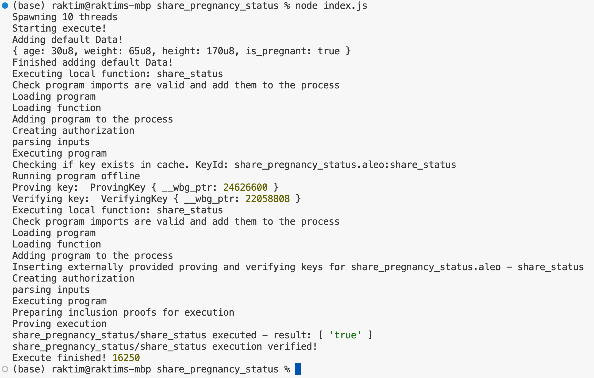

# ALEO WORKSHOP

## Challenge

We will be going through the Aleo quickstart but participants will be tasked with customizing with a women's health focus. Examples could be showcasing the use cases of zk in health.

## Solution

### Leo Program: Sharing Pregnancy Status Privately

This Leo program demonstrates how to share pregnancy status without revealing other health information. Here's a breakdown of the program:

1. We define a `HealthInfo` struct that contains various health-related fields, including `is_pregnant`.

2. The `share_status` transition function takes a `HealthInfo` struct as input and returns only the `is_pregnant` boolean value.

3. The `example` function shows how you might use this in practice. It creates a `HealthInfo` instance with sample data and then calls `share_status` to share only the pregnancy status.

In this program, when `share_status` is called, it will only return the boolean value of `is_pregnant`, keeping all other health information private. This leverages Aleo's privacy features to ensure that only the specific information you want to share (pregnancy status) is revealed, while keeping other sensitive health data confidential.

To use this in a real Aleo application, you would deploy this program to the Aleo network and then call the `share_status` transition function with your actual health information. The network would execute this function and return only your pregnancy status, without revealing any other data.

## Result

## Frontend Integration

- The website is available for testing in the [link](https://buildh3r-october-workshop.pages.dev)
